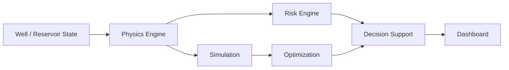

# 🚀 PetroForge

### Physics + AI Digital Twin for Well-to-Surface Optimization of CSS & SRP Operations in Heavy Oil Wells

PetroForge is an **SIH26120 prototype** that connects reservoir behavior, wellbore conditions,
SRP performance, production, mechanical risk, what-if simulation, and joint CSS × SRP
optimization into one deterministic engineering decision-support layer — built for the heavy
oil wells of Baghewala Field (Oil India Limited).

> **Status honesty first:** this baseline is a deterministic **prototype simulator**.
> No trained ML model, no field calibration, no live field data, and no equipment control
> exist in this baseline. Facts from the problem statement are tagged **[PS]**,
> prototype assumptions **[PROTO]**, standard engineering **[STD]**.

[](https://www.python.org)
[](https://fastapi.tiangolo.com)
[](./project)
[](./project/docker-compose.yml)
[](https://sih.gov.in)

---

## 1. 🌐 Project Vision

Heavy-oil CSS + SRP operations form one coupled chain:

```
Reservoir → Wellbore → SRP → Surface → Production → Analytics → Simulation → Optimization → Decision Support
```

Tuning steam injection and pump settings **in isolation** is insufficient: steam changes
temperature → viscosity → mobility → inflow, while the pump can only lift what the reservoir
delivers. An oversized pump against weak inflow creates impact loading and unsetting risk;
excess steam inflates SOR and energy cost. PetroForge couples both sides in a single
transparent calculation so every recommendation shows its production / SOR / energy / risk
trade-off.

## 2. 🎯 SIH 26120 Problem

- **[PS]** Heavy crude (17–19° API), Jodhpur Sandstone, Baghewala Field, Rajasthan
- **[PS]** Low reservoir pressure, low reservoir temperature (46–48 °C), high viscosity, high asphaltene, poor primary mobility
- **[PS]** CSS decisions (steam volume, injection pressure, soak time, production cut-off) based on historical practice
- **[PS]** SRP decisions (stroke length, SPM, VFD) adjusted manually and reactively
- **[PS]** Rod floating, impact loading, frequent pump unsetting, rod failures, high SOR and energy use
- **[PS]** Need: integrated, data-driven well-to-surface optimization

## 3. 💡 PetroForge Approach



Deterministic prototype physics **[PROTO]** produces a twin snapshot; transparent risk
proxies score mechanical mismatch; side-effect-free simulation answers "what if…"; a
bounded grid search recommends a joint CSS × SRP scenario with value-traceable reasons.

## 3a. 🆕 Block 4 — closing the gaps in the problem statement

| Problem statement asks for | What PetroForge now does | Module |
|---|---|---|
| CSS decisions: steam volume, soak time, **production cut-off** | Day-by-day CSS cycle through the twin (injection → soak → cooling production decline); **optimal cut-off** = day the cycle-average oil rate peaks; cycle SOR in bbl CWE/bbl; 25-plan steam × soak planner under an SOR ceiling | `css_cycle.py` |
| SRP: stroke, SPM, **VFD** | VFD ↔ SPM drive mapping; every simulate/optimize result carries an actionable **VFD setpoint** | `twin_physics.py`, `twin_optimize.py` |
| Rod floating, impact loading, pump unsetting | Predicted **surface dynamometer card** (API 11L rods, Mills acceleration, 0.340·SG·D²·H fluid load, viscous drag at tubing temperature, modified Goodman) → FLUID POUND / ROD FLOAT / ROD OVERLOAD diagnosis | `srp_dynacard.py` |
| **Predictive analytics** | Twin **auto-calibration** (robust least-squares scale factor, MAPE before/after), **anomaly detection** (median/MAD z-score + engineering deadbands + calibrated-twin divergence), **Arps decline forecast** | `analytics.py` |
| **AI-enabled** | 30-day **rod-failure / pump-unsetting probability** models (numpy logistic regression, 9 physics-informed features, per-prediction attributions, holdout AUC reported against the oracle ceiling) | `ml_models.py` |
| **Real-time monitoring** | Live synthetic field (4 wells cycling through CSS, injected pump-wear / wellhead-surge faults) → same ingest path → **SSE stream** + latched **alerts** with ACK | `live_field.py`, `app.py` |
| Physics honesty | Water cut applied (pump lifts liquid, oil = liquid × (1 − WC)); production-phase cooling via `days_in_phase`; estimated pump fillage | `twin_physics.py` |

**Honest data statement.** Failure labels come from a documented synthetic hazard model and
the live field is synthetic (`SYNTHETIC_BAGHEWALA`); no Oil India data is included. What is
demonstrated is the working pipeline, which retrains unchanged on real failure logs and SCADA
readings. Evidence that the pipeline works: calibration recovers each synthetic well's hidden
productivity factor to ±0.005; every injected fault is caught, and alarm deadbands suppress
noise-only alerts; model AUC matches the oracle ceiling (rod 0.727 vs 0.729, unsetting 0.867 vs 0.864).

**Dashboard (Next.js, `frontend/`).** The 3D twin inspector gains WHAT-IF sliders (steam,
pressure, soak, VFD, stroke, water cut), CYCLE (decline curve + cut-off + planner
heat-map), SRP (dynacard + diagnosis), ANALYTICS (measured vs calibrated twin, decline
forecast, anomalies) and ML (probabilities, drivers, risk trend, model card). The top bar has
field KPIs, a **GO LIVE** toggle and an alerts drawer.

## 4. 🧠 Digital Twin Model

Implemented in `project/twin_physics.py` (deterministic, unit-aware, no randomness):

| Component | Implemented relationship |
|---|---|
| Heating **[PROTO]** | `T = T_base + 180·I·(1 − exp(−t/72))`, `I = clamp(0.5·V/1000 + 0.5·P/70, 0, 1)` |
| Cooling **[PROTO]** | `T = T_base + (T_peak − T_base)·exp(−t/72)`; `IDLE` phase uses this branch |
| Effective temperature | Heating at `soak_time_h` exposure; clamped to [0, 350] °C |
| Viscosity **[PROTO]** | `μ = 350·exp(4500·(1/(T+273.15) − 1/(47+273.15)))·API_factor`, clamped to [0.1, 100000] cP (always positive) |
| Mobility **[PROTO]** | `mobility = 350 / μ` (1 at reference viscosity) |
| Reservoir inflow **[PROTO]** | `q = 0.8·max(P_res − P_wh, 0)·mobility`, capped at 5000 bopd, never negative |
| SRP theoretical **[PROTO+STD]** | `Q = (π/4·D²)·stroke·SPM·1440/9702` bopd, D = 2.0 in bore **[PROTO]** |
| Pump actual **[PROTO]** | `Q_actual = Q·fillage(0.85)·efficiency(0.75)` — fixed defaults, clearly marked |
| Coupled production | `production = min(inflow, pump)` + `INFLOW_LIMITED` / `PUMP_LIMITED` label |
| SOR (prototype t/bbl) | `steam_t / (production·30 days)`; `None` + `UNDEFINED_ZERO_OIL` at zero production |
| Energy (per 24 h day) **[PROTO]** | `steam_t·750` kWh + `SPM·stroke·0.5` kWh; per-barrel when production > 0 |
| Rod floating **[PROTO]** | `clamp(μ/2000, 0, 1)` — thicker oil supports the rod string |
| Impact loading **[PROTO]** | pump-demand-vs-inflow mismatch + SPM aggressiveness blend |
| Pump unsetting **[PROTO]** | inflow/pump mismatch fraction + wellhead-vs-reservoir pressure factor |

Reference anchors from the problem statement: 47 °C (midpoint of **[PS]** 46–48 °C) and
18° API (midpoint of **[PS]** 17–19° API). Everything else above is a prototype
assumption — see `project/solution.md` Appendix A.

## 5. 🔥 CSS + SRP Physics

```
Steam (V, P, soak) → thermal state → viscosity → mobility → reservoir inflow  [PROTO]
Stroke × SPM → pump capacity → coupled production = min(inflow, pump)         [PROTO]
```

The prototype couples both sides with the limiting relationship: the well produces what
the reservoir delivers **and** what the pump can lift, whichever binds. No
petroleum equations beyond those in §4 are claimed.

## 6. ⚙️ Simulation Engine

`POST /api/v1/wells/{well_id}/simulate` accepts optional overrides (steam volume /
pressure, soak, SPM, stroke, phase), builds a hypothetical state copy, and returns
current + scenario snapshots with `scenario − current` deltas. **Deterministic and
side-effect free** — well record, twin, audit log, and well count verified byte-identical
after simulation.

```json
// request:  {"steam_volume_t": 1000.0, "spm": 6.0}
// response: {"current": {...}, "scenario": {...},
//            "delta": {"production_delta_bopd": 28.5, "sor_delta_t_per_bbl": ..., ...}}
```

## 7. 🎯 Optimization Engine

Deterministic bounded grid search over the Block 2 physics (no scipy, no ML):

- **Dimensions:** steam volume, steam injection pressure, soak time, SPM, stroke
  (`vfd_percent` excluded — no physics function consumes it; documented, not faked)
- **Default grid:** 600/800/1000 t × 50/65/80 bar × 24/48/72 h × 4/6/8 SPM × 72/84/96 in
  → **3⁵ = 243 scenarios**
- **Objective (prototype demonstration weights — NOT Oil India provided):**
  `score = 0.40·norm(production) − 0.25·norm(SOR) − 0.15·norm(energy) − 0.20·mean_risk`,
  min-max normalized per run, deterministic tie-break
- **Constraints:** input-safety ranges enforced by rejection (HTTP 422), custom grids
  1–5 values/dimension, max 2000 combinations
- Returns recommended scenario (+score/inputs), current-vs-recommended delta, **top-5
  scenarios**, and `why_recommended[]` reasons emitted only when their numeric condition
  holds. Live example: 142.7 → 228.3 BOPD (+85.6), SOR 0.1986 → 0.0876, energy −187356 kWh.

## 8. 🚨 Risk Engine

Three deterministic prototype indicators, each returning `risk_level`
(LOW <0.33 / MODERATE <0.66 / HIGH), `risk_score` 0–1, and a `reason` embedding the
actual numbers: **rod floating**, **impact loading**, **pump unsetting**. These are
engineering proxies — **not** validated failure prediction, **not** probabilities,
**not** ML outputs.

## 9. 📊 Dashboard

`project/index.html` (Tailwind + Chart.js + Lucide, dark engineering theme) renders
**only real API responses** — no `Math.random`, no mock values, no fabricated history:

- Well selector (from `GET /wells`), backend status, refresh, BGW-DEMO baseline loader
- KPI cards: BOPD, °C, cP, prototype SOR, kWh, risk status
- Reservoir → Wellbore → SRP → Surface flow with live values
- CSS phase highlight + current operating state (incl. VFD from telemetry)
- What-if panel with current-vs-scenario deltas ("simulation only" notice)
- Optimization panel: recommended scenario, deltas, top-5 table, reasons
- Real-data bar charts, risk cards, backend explanations, audit timeline, system status

## 10. 🏗️ Current Architecture

```
Frontend (index.html, fetch only)
  ↓
FastAPI (app.py — routes, Pydantic validation, stores)
  ↓
Domain Models (WellTelemetry, snapshot/response schemas)
  ↓
Physics Engine (twin_physics.py)
  ↓
Risk Engine (deterministic indicators)
  ↓
Simulation (side-effect-free) → Optimizer (grid search)
  ↓
Audit (in-memory SHA-256 log)
```

```
project/
├── app.py
├── twin_physics.py
├── twin_optimize.py
├── index.html
├── test_app.py
├── test_twin_physics.py
├── test_twin_optimize.py
├── solution.md
├── requirements.txt
├── Dockerfile
└── docker-compose.yml
```

## 11. 🔌 API Endpoints

| Method | Route | Description |
|---|---|---|
| `GET` | `/` | Health + SIH26120 metadata |
| `POST` | `/api/v1/telemetry/ingest` | Validate + store well telemetry, attach twin summary (201) |
| `GET` | `/api/v1/wells` | Merged list: telemetry + 5 publicly verified well records (bootstrap) |
| `GET` | `/api/v1/wells/{well_id}` | Telemetry, or public-record envelope (`telemetry: null`) |
| `GET` | `/api/v1/wells/{well_id}/twin` | Snapshot; `INSUFFICIENT_PUBLIC_TELEMETRY` for public-only wells |
| `POST` | `/api/v1/wells/{well_id}/simulate` | Side-effect-free what-if + deltas |
| `POST` | `/api/v1/wells/{well_id}/optimize` | Joint grid search: recommended + top-5 + reasons |
| `GET` | `/api/v1/wells/{well_id}/cycle` | CSS cycle series + optimal cut-off + cycle SOR |
| `POST` | `/api/v1/wells/{well_id}/cycle/plan` | Steam × soak planner under an SOR ceiling |
| `GET` | `/api/v1/wells/{well_id}/dynacard` | Predicted dynamometer card, rod loads, diagnosis |
| `GET` | `/api/v1/wells/{well_id}/predict` | 30-day rod-failure / pump-unsetting probabilities + drivers |
| `GET` | `/api/v1/ml/model` | Model card: data statement, coefficients, holdout + oracle metrics |
| `GET` | `/api/v1/wells/{well_id}/history` | Measured telemetry beside the twin prediction |
| `GET` | `/api/v1/wells/{well_id}/analytics` | Calibration, anomalies, decline forecast |
| `GET` | `/api/v1/field/overview` | Field KPIs (measured vs calibrated twin), phases, alerts |
| `GET` | `/api/v1/alerts` · `POST /api/v1/alerts/{id}/ack` | Latched alerts + acknowledgement |
| `POST` | `/api/v1/demo/seed` | Backfill the synthetic field (default 45 days) |
| `POST` | `/api/v1/live/start` · `/stop` · `/tick` · `GET /status` | Live synthetic field control |
| `GET` | `/api/v1/stream` | Server-Sent Events: one event per ingested reading |
| `GET` | `/api/v1/audit/logs` | SHA-256 audit records |
| `POST` | `/api/v1/action/dispatch` | Legacy acknowledgement (no field commands) |
| `GET` | `/docs` | Swagger UI |

## 12. 🧪 Testing & Validation

**238/238 tests passing** (`pytest -q` in `project/`): 19 telemetry/API regression + 21 physics
directional-behavior + 16 simulation/optimizer tests + 29 data-foundation tests
+ 18 public-recovery tests (registry, bootstrap, provenance separation, compat)
+ Priority 1-3 hardening, historical-engine and ML-intelligence suites
+ 26 Block 4 tests (`test_block4.py`: water cut, production cooling, VFD, dynacard,
cycle cut-off optimality, planner, calibration incl. fault robustness, anomalies,
decline fit, ML vs oracle AUC, simulator determinism, alerts latching, live tick,
SSE stream, ingest contract, synthetic IDs never reuse public well IDs).
Additionally validated live: 38/38 end-to-end
checks (full journey, physics directionals A–H, risk reproducibility, 243-grid,
404/422 handling) and 9/9 dashboard contract checks.

## 13. 🚀 Quick Start (Windows PowerShell)

```powershell
git clone https://github.com/sambhav-coder/Petro_Forge.git
cd Petro_Forge
python -m venv .venv
.\.venv\Scripts\Activate.ps1
pip install -r project/requirements.txt
cd project
python app.py
```

- API: http://127.0.0.1:8000 · Swagger: http://127.0.0.1:8000/docs
- Dashboard (needs backend running): `python -m http.server 8080` in `project/`, open http://localhost:8080, click **Load BGW-DEMO baseline**
- 3D twin dashboard: `cd frontend && npm install && npm run dev`, open http://localhost:3000/twin,
  click **Load synthetic field**, then **GO LIVE** (backend must be running on :8000)
- Tests: `pytest -q` in `project/` (expect 238 passed)
- Data docs: `project/data_catalog/README.md` (sources, schemas, quality, synthetic strategy)

## 14. 🐳 Docker

`Dockerfile` (Python 3.11-slim, uvicorn :8000) and `docker-compose.yml`
(`api` :8000 + nginx dashboard preview :8080) exist and contain no stale assumptions:

```powershell
cd project
docker-compose up --build
```

> Not validated with a local Docker engine in this environment — reported honestly;
> local `uvicorn` + `pytest` runs above are the verified paths.

## 15. 📐 Prototype Assumptions & Limitations

- Deterministic prototype-level model, **not calibrated** against Baghewala measurements
- Public Baghewala data: field-level context + 5 publicly verified well records
  (historical/status/CSS/sparse production evidence); **no verified complete
  continuous well-by-well SCADA telemetry was found** (no per-well continuous
  SPM/VFD/pressure/temperature streams; no complete well census, CSS parameter
  history, SRP telemetry, or continuous production streams)
- Synthetic data is for demos/pipeline testing only — NOT measured Baghewala
  data, calibration data, or evidence of actual well behavior
- Derived values (e.g. BGW-08 85 BOPD midpoint of reported 80–90 BOPD) are
  labeled DERIVED, never raw measurements
- SOR is a prototype t/bbl convention (steam tonnes / oil barrels over 30 days)
- Energy coefficients, objective weights (0.40/0.25/0.15/0.20), fillage/efficiency
  (0.85/0.75), risk bands are fixed prototype assumptions
- VFD maps linearly to SPM through a prototype drive ratio (10 SPM at 100%)
- Storage is **in-memory** (restart wipes state); audit log capped at 100, history at 720 readings/well
- ML models are trained on **synthetic hazard labels**, not field failure logs; the live
  field is synthetic. Both are clearly tagged and swap for real data without code changes
- Pump depth (1100 m), rod string (7/8 in), drag coefficient and cycle constants are prototype values
- The cycle planner often recommends the edge of its steam/soak grid: the prototype thermal
  model has no heat loss during soak, so longer soak only costs downtime
- No production control loop

## 16. 🔐 Safety / Engineering Position

PetroForge is **decision support, not control**: simulate/optimize endpoints never issue
field commands and touch no equipment. Real deployment would require field data,
calibration, engineering validation, operational constraints, safety review,
domain-expert approval, and monitored deployment.

## 17. 🗺️ Roadmap (future work — NOT implemented)

- ~~Phase 1 — Interactive 3D Digital Twin~~ (done)
- Phase 2 — Historical/Public Data Platform (history + analytics done; persistence pending)
- ~~Phase 3 — ML Intelligence~~ (done on synthetic labels; retrain on field logs)
- ~~Phase 4 — Physics + ML Hybrid Twin~~ (auto-calibration + physics-informed features)
- ~~Phase 5 — Advanced SRP/Pump Visualization~~ (dynamometer card)
- ~~Phase 6 — CSS Intelligence~~ (cycle simulation, cut-off, planner)
- Phase 7 — Advanced Multi-objective Optimization
- Phase 8 — Full Control-Room Experience
- Phase 9 — Production-grade Deployment

## 18. 🤝 Team / Contribution

| Role | Member |
|---|---|
| — | *To be filled by the team* |

No team information was found in the repository, so names are intentionally left blank
rather than invented. Contributors: keep physics changes reproducible and covered by
tests; never commit `.venv/`, caches, secrets, or IDE metadata (see `.gitignore`).

## 19. 📜 License

**No LICENSE file exists in the repository**, and the project originated from an
existing base — so no license is added here and no ownership is claimed over every
component. **Decision needed from the owner:** choose and add a license (e.g. MIT for
your own code with third-party notices, or SIH-appropriate terms) before public reuse.

## 20. 🏆 SIH Submission

- Smart India Hackathon 2026 · Problem Statement **SIH26120**
- Organization: **Oil India Limited** · Category: **Software** · Theme: **Smart Automation**

## 21. 📚 Documentation

- [Technical solution (`project/solution.md`)](./project/solution.md) — equations, provenance table, validation, demo flow
- [Run guide (`project/README.md`)](./project/README.md) — API overview, assumptions, limitations
- [Swagger UI](http://127.0.0.1:8000/docs) — live endpoint reference (backend running)
- [Problem statement (`problem_statement.json`)](./problem_statement.json) — official SIH metadata

## 22. ⭐ Why PetroForge

Isolated steam tuning and isolated pump tuning leave the inflow/lift mismatch — and its
SOR, energy, and mechanical costs — invisible. PetroForge moves that decision into one
integrated well-to-surface workflow where every recommendation carries its numbers.
